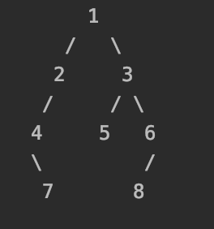

# BinaryTreeVisual


## install

进入dist文件夹 执行pip install ****.tar.gz 既可

## requirement

单结点的格式要求

```python
class TreeNode():
    def __init__(self):
        self.val = -1
        self.left = None
        self.right = None
```

## usages

安装以后，库名叫BinaryTreeVisual，目前有两个函数包BinaryTreeVisual 以及TraverseTree，前者封装了可视化二叉树的方法，直接在终端输出，后者封装了先序，中序后序遍历，以及层次遍历的二叉树遍历方法

如想自己编译可先执行如下语句，会生成新版本的库

```
python setup.py dist
```

如需可视化请按如下执行

```python
import BinaryTreeVisual.BinaryTreeVisual as btt
btt.BinaryTreeVisual(root)
```



如需遍历二叉序请执行

```python
import BinaryTreeVisual.TraverseTree as btt
btt.preorder_Recursion(root) #先序
```


## 备注：

当前版本为0.0.1

### done

~~二叉树可视化~~
~~先序、中序、后序遍历(递归实现)~~
~~层次遍历~~

0.0.2版本计划实现

### todo

先序、中序、后序遍历（递归实现）	
中序加先序建立二叉树（功能已实现，待集成）
中序加后序建立二叉序（功能已实现，待集成）


仅做个人练手，随意使用，欢迎告知bug